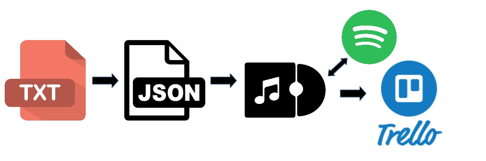

Coding test
===

## Issue
> The attached file [discography.txt](./src/assets/discography%20.txt) contains Bob Dylan's discography.
>
> Our goal is to get a Trello board by interacting with the Trello API, with the albums sorted in lists sorted by decade.
>
> Each album must show its year and title and appear in the list ordered by year and, in the case of the same year, alphabetically.
>
> Also, we would like each album to have the cover if we can search for it on Spotify.
>
> Your solution should be able to do it from discography file.

 

 

## General ideas

We can resume the main workflow of our application in the following image

Here we can have a general idea of ​​what our application should do:
* We need to upload a plain text file (containing a list of album name pairs and years).
* We need to parse this file to a machine readable format. Here we will use [JSON](https://www.json.org/ "JSON official website") a simple interchange data text format.
* Then we need to get the cover image of each album. We will use the Spotify public API for this task.
* Finally we will create a [Trello](https://trello.com "Official Trello website") board to show our albums, sorted by year / name in various lists / cards.

## Discussion

This problem can be solved in many ways / programming languages. But I like to use a Client-Server architecture, using ReactJS on the client side and Node / Express on the server, even if all this problem can be solved directly on the client, with JS without a library. I prefer a scalable and 'bullet-prof' design, where the server handle the main responsability, and the clients just send the required data `the list of albums-years` and the receive a confirmation of the task done... or not.

### Assignment of responsibilities

* In the client we must choose the input file `.txt`. The task of analyzing this file can be done on the client, using the JSON format for communication with the server.
* The server should make some request to Spotify public API in orden to get the cover Picture for each disc. 
* Once we got all this info, the server should make a request to Trello public API to create the desired Board and Cards, sorted by Years/Alphabetic
* Finally te server should inform to frontend about the end of this task, succefully or fail.
